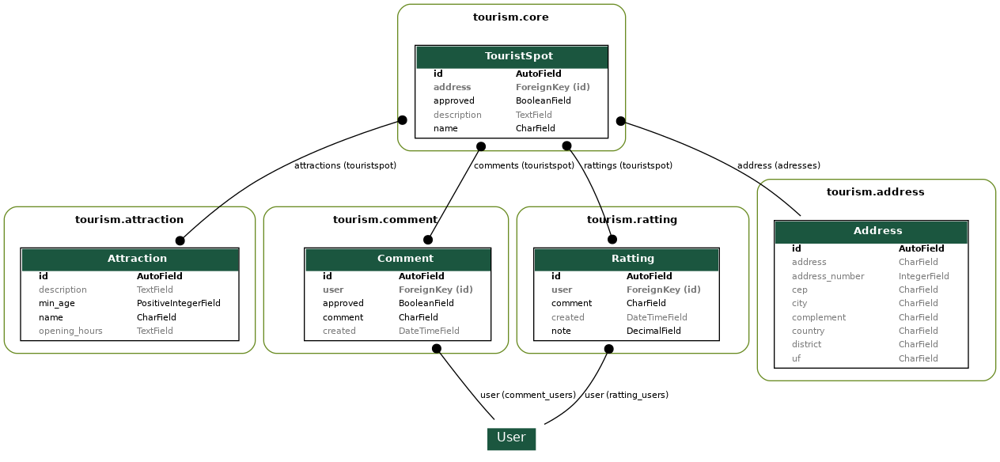

# drf-tourism

Curso de DRF - tema Turismo


## This project was done with:

* [Python 3.8.2](https://www.python.org/)
* [Django 2.2.19](https://www.djangoproject.com/)
* [Django Rest Framework 3.12.2](https://www.django-rest-framework.org/)

## How to run project?

* Clone this repository.
* Create virtualenv with Python 3.
* Active the virtualenv.
* Install dependences.
* Run the migrations.
* Create a token.


```
git clone https://github.com/rg3915/drf-tourism.git
cd drf-tourism
python -m venv .venv
source .venv/bin/activate
pip install -r requirements.txt
python contrib/env_gen.py
python manage.py migrate
python manage.py createsuperuser --username="admin" --email=""
python manage.py drf_create_token admin
```


## Este projeto foi feito com:

* [Python 3.8.2](https://www.python.org/)
* [Django 2.2.19](https://www.djangoproject.com/)
* [Django Rest Framework 3.12.2](https://www.django-rest-framework.org/)

## Como rodar o projeto?

* Clone esse repositório.
* Crie um virtualenv com Python 3.
* Ative o virtualenv.
* Instale as dependências.
* Rode as migrações.
* Crie um token.


```
git clone https://github.com/rg3915/drf-tourism.git
cd drf-tourism
python3 -m venv .venv
source .venv/bin/activate
pip install -r requirements.txt
python contrib/env_gen.py
python manage.py migrate
python manage.py createsuperuser --username="admin" --email=""
python manage.py drf_create_token admin
```


### Obter um token

No Postman, entre no endpoint

```
http://localhost:8000/api-token-auth/
```

E faça um POST com

`Body > form-data` informando `username` e `password`.


### graph models

https://gist.github.com/rg3915/35e999a442a8955e455b

```
python manage.py graph_models -e -g -l dot -o models.png core attraction comment ratting address
```



### Exemplos


```
{
    "name": "Circo",
    "description": "Circo da Alegria",
    "approved": true,
    "attractions": [
        {
            "name": "Leão",
            "min_age": "3"
        },
        {
            "name": "Palhaço",
            "min_age": "2"
        }
    ]
}
```

```
{
    "name": "Parque de diversões",
    "description": "Super legal",
    "approved": true,
    "attractions": [
        {
            "name": "Carrossel",
            "min_age": "4"
        },
        {
            "name": "Montanha Russa",
            "min_age": "6"
        }
    ],
    "address": {
        "address": "Rodovia"
    }
}
```
